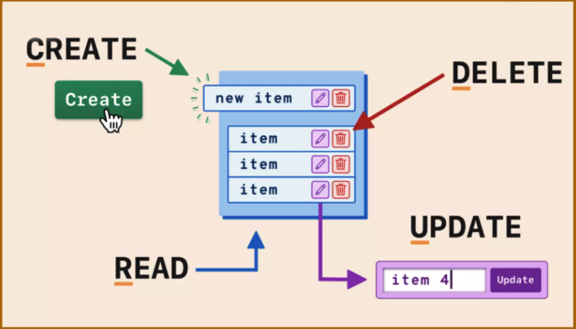

# CRUD SIN MVC

# Información del Proyecto

| **Campo**         | **Detalles**                                                                 |
|--------------------|-----------------------------------------------------------------------------|
| **Asignatura**     | [PROGRAMACIÓN](https://www.notion.so/PROGRAMACI-N-11aaa0187ce2810a874df38b7c463768?pvs=21) |
| **Grupo**          | DA1D1E                                                                     |
| **Nombre**         | Emanuel Alejandro Lima Soto                                                |
| **Notion Page**    | [CRUD SIN MVC](https://glitter-knave-762.notion.site/CRUD-SIN-MVC-1daaa0187ce280c9a314f2cabaa9117f?pvs=4) |
| **GitHub**         | [Crud-Instituto-Java](https://github.com/alicenon/Crud-Instituto-Java)      |

# LLEGANDO A LA SOLUCIÓN CRUD SIN MVC



Antes de llegar a la solución de estas 4 operaciones para Crear, Actualizar, Borrar y Leer 

Hice uso de Jtable

En Clase ya lo tenía incluso cuando me equivoqué pensando que habia que hacer una especie de CRUD


Ver por ID que puede ser otro y podría corresponderse a Leer


Lo Agregaba


Eliminaba


### No la hice MVC porque…

No he podido Hacer mi solución con las carpetas porque no me pude dar el tiempo, pero no quiere decir que no podía hacerlo, ya que logré eso antes en una hora, solo quería aclarar eso. 

### Primeros pasos antes de la solución

Dejo la URL del repositorio para no Olvidarme y completarlo más adelante.


**table = new JTable();
        table.setModel(new DefaultTableModel(
            new Object[][] {
                {"xxxx1","Pepe", "editar"},//filas
                {"xxxx2", "Mario", "editar"},
                {"xxxx3", "Maria", "editar"},
                {"xxxx4", "Jose", "editar"}
            },
            new String[] {
                "dni", "nombre" , "acciones"
            }
        ));
        table.addMouseListener(new MouseAdapter() {
            *@Override*
            public void mouseClicked(MouseEvent e) {
                int numcolumnas = table.getColumnCount();
                int numFila = table.getSelectedRow();//RETORNA EL NUMERO DE POSICION DE LAS FILAS - 0,1,2,3
                int numCol= table.getSelectedColumn();//RETORNA EL NUMERO QUE PERTENECE A LA COLUMNA - 0,1,2
                String numDni = (String) table.getValueAt(2, 0); //OBTIENE EL VALOR DE LA FILA Y LA COLUMNA
                JOptionPane.*showInputDialog*(contentPane, "confirma editar", numcolumnas + " : " + numDni + ", numero de fila: " + ++numFila );
            }
        });**


**`SetValueAt`: Establece el valor de la celda en el modelo de tabla, tanto en la fila como en la columna.**


PARECE QUE SOLO OBTIENE EL NOMBRE DE CLASE Y PAQUETE CON REFERENCIA AL EVENTO


En `SetValueAt`:

`void javax.swing.JTable.setValueAt(Object aValue, int row, int column)`

**"aValue" es el nuevo valor para el nombre.**

**“fila y columna”  de la celda que se va a cambiar.**


**PARA EL BOTON HE USADO UNA IA QUE ME AYUDASE Y LLEGUE A LA SOLUCIOND E HACER OTRA CLASE PARA EL BOTON CON USO DE AWT PARA LAS PROPIEDADES**

**`value == null`** :

- Verifica si el valor de la celda es **`null`**.
- Esto puede suceder si la tabla no tiene un valor definido para esa celda.

En mi caso de prueba actual no pasaría nada porque tengo definida los campos de “Editar” de la columna de Acciones en el Array de objetos bidimensional.

**Lo tengo así con el operador ternario por si tengo que usarlo con los valores que me venga de la tabla de la base de datos**

Si bien he usado IA, he comprendido eso para tratar los datos dinámicos que me vienen de una tabla en una base de datos.


LUEGO HICE CAMBIOS EXTRAS EN EL DISEÑADOR 


**CONTROLAR ERROR DE SOLO AL DARLE X SE BORRA EL NOMBRE DE LA CELDA (NOMBRE DISTINTO DE NULO)**


UNA FORMA DE SOLUCIONARLO FUE:

```jsx
if (mostrarNombre != null) 
		table.setValueAt(mostrarNombre, numFila, 3); 
```

## CAMBIOS PARA EL CRUD SIN MVC COMENZANDO TAREA

USO DE **DefaultTableModel**


## CREATE

Si bien pude haber hecho varios JOptionPane para ingresar los datos del alumno, esta he optado por un formulario .

Quería practicarlo  de esta forma, pues también pude haberlo hecho en el mismo Jframe a un lado, con el de editar y llevar los datos de la fila que di click, pero como ya lo tenía con el JOptionPane , lo dejé así, y quería probar al haciendo click sobre un botón de crear, instanciar un formulario para la creación de un alumno.

y necesitba hacerlo porque debia mandar el modelo que almacena los datos del alumno

**FormularioDatosAlumno(DefaultTableModel modelJTable)**


**public static void main(String[] args) {
		EventQueue.*invokeLater*(new Runnable() {
			public void run() {
				try {
					FormCreateAlumno frame = new FormCreateAlumno();
					frame.setVisible(true);
				} catch (Exception e) {
					e.printStackTrace();
				}
			}
		});
	}**

Eso debería quitarlo, debido a que lo voy a instanciar el formulario con el botón de crear. Pero lo fui dejando un rato porque no me dejaba seguir con el diseño

Luego opté un diseño con GridLayout ya que es JLabel - JTextField 


***java.awt.GridLayout.GridLayout(int rows, int cols, int hgap, int vgap)***

son 4 filas + el botón = 5 y 2 columnas 


### XAMP


## READ

He dejado una clase `Ejemplo1Layout` como fui desarrollando esta base y en la parte de Introduccion también tengo una parte de como fui llegando a la solución.


### JTABLE


## UPDATE

En este paso he usado el botón que fui desarrollando para **editar**

## DELETE

[https://docs.oracle.com/en/java/javase/22/docs/api/java.desktop/javax/swing/table/DefaultTableModel.html](https://docs.oracle.com/en/java/javase/22/docs/api/java.desktop/javax/swing/table/DefaultTableModel.html)


**Clase DefaultTableModel**


